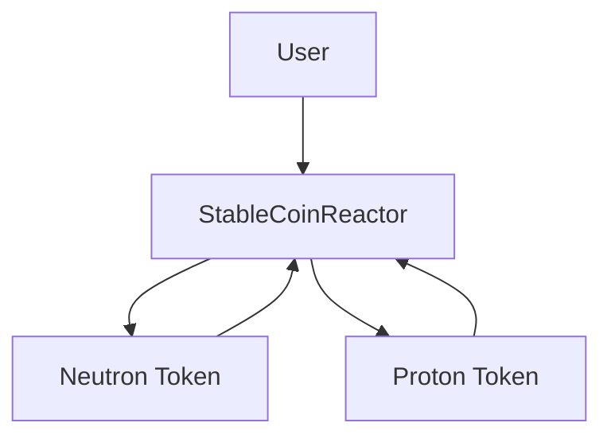
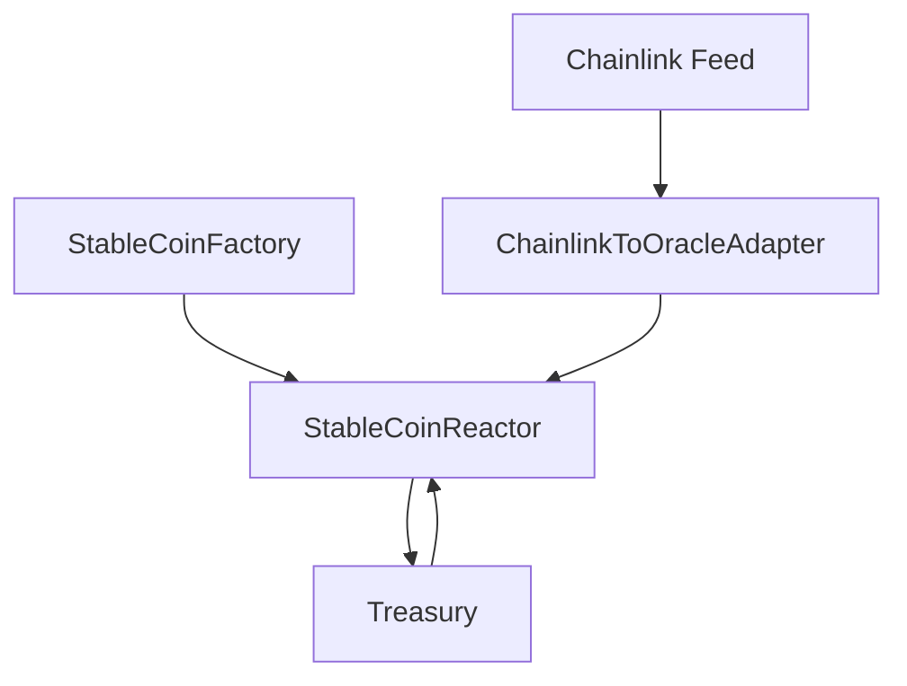

<p align="center">
  <a href="https://github.com/StabilityNexus">
    
  </a>
</p>

<div align="center">

# Gluon-EVM

**A modular EVM-based DeFi protocol for splitting reserve-backed value into stable and volatile assets.**

Developed under [**Stability Nexus**](https://github.com/StabilityNexus)

[](https://github.com/StabilityNexus/Gluon-EVM/actions/workflows/test.yml)
[](https://soliditylang.org/)
[](https://getfoundry.sh/)

</div>

<p align="center">
  <a href="https://t.me/StabilityNexus">
    
  </a>
  &nbsp;
  <a href="https://x.com/StabilityNexus">
    
  </a>
  &nbsp;
  <a href="https://discord.gg/YzDKeEfWtS">
    
  </a>
  &nbsp;
  <a href="https://linkedin.com/company/stability-nexus">
    
  </a>
</p>

---

## Overview

Gluon is an EVM-based DeFi smart-contract protocol built around a contract called the `StableCoinReactor`.

Each reactor is configured with:

- a reserve or base ERC-20 asset
- an `IOracle`-compatible price source
- treasury settings
- fission and fusion fees
- a critical reserve-ratio parameter
- metadata for the reserve, pegged asset, Proton, and Neutron tokens

Users deposit the base asset through **fission**, which creates two connected protocol assets:

- **Neutron** — the stable or pegged-side asset
- **Proton** — the volatile or residual-side asset

The reverse operation is **fusion**. Users burn the required Proton and Neutron amounts and receive the underlying base asset back.

Gluon also supports **transmutation**, allowing value to move between Proton and Neutron using the reactor's current pricing state and configurable beta-fee parameters.

> [!WARNING]
> Gluon is under active development. The contracts should be treated as experimental and are not intended for production use without further review, testing, and security assessment.

---

## Features

- **Factory-based deployment** — deploy multiple independent `StableCoinReactor` instances through `StableCoinFactory`
- **Fission** — deposit reserve assets and mint Proton and Neutron
- **Fusion** — burn Proton and Neutron and withdraw reserve assets
- **Transmutation** — convert value between Proton and Neutron
- **Generic oracle interface** — use any oracle implementation compatible with `IOracle`
- **Chainlink support** — normalize Chainlink price-feed values to 18-decimal WAD format
- **Configurable fees** — separate fission and fusion fees
- **Dynamic beta fees** — treasury-controlled parameters for transmutation fees and decay
- **On-chain pricing views** — expose reserve ratio and Proton/Neutron price calculations
- **Foundry test suite** — unit and integration tests for adapters, factory deployment, and reactor flows
- **Continuous integration** — formatting, build, and test checks through GitHub Actions

---

## How It Works

### Fission

A user deposits the configured base ERC-20 asset into a reactor.

The reactor:

1. transfers the base asset from the user
2. sends any configured fission fee to the treasury
3. calculates the Proton and Neutron outputs
4. mints both assets to the selected recipient

For the first deposit, the reactor bootstraps the initial Proton and Neutron split using the oracle price.

For later deposits, the output is calculated proportionally using the existing reserve and token supplies.

### Fusion

A user specifies an amount of the base asset to withdraw.

The reactor:

1. calculates the proportional Proton and Neutron amounts that must be burned
2. burns both tokens from the user
3. applies the configured fusion fee
4. returns the remaining base asset to the selected recipient
5. sends the fee to the treasury

### Transmutation

Users can convert:

- Proton to Neutron
- Neutron to Proton

The conversion uses:

- the current reactor reserve
- Proton and Neutron token supplies
- the oracle price
- the current beta-fee parameters
- the reactor's decayed transmutation-volume state

### Oracle Pricing

Gluon reads the reserve asset price through the shared `IOracle` interface.

Oracle values are expected in **WAD format**, meaning 18 decimals.

The `ChainlinkToOracleAdapter`:

- reads the latest Chainlink feed value
- rejects invalid or non-positive values
- scales the value to 18 decimals
- exposes the feed description
- exposes the latest update timestamp

---

## Architecture

The system has two main parts:

1. the **reactor flow** for user interactions and token mint/burn logic
2. the **deployment and oracle flow** for factory deployment, pricing, and treasury control

### Reactor Flow



- The **user** interacts with the **StableCoinReactor**.
- During **fission**, the user deposits the base asset into the reactor.
- The reactor mints **Neutron** and **Proton** tokens.
- During **fusion** or **transmutation**, Neutron and/or Proton flow back into the reactor.

### Deployment and Oracle Flow



- `StableCoinFactory` deploys new `StableCoinReactor` instances.
- `ChainlinkToOracleAdapter` reads data from the `Chainlink Feed`.
- The adapter provides WAD-normalized oracle values to the reactor.
- The `Treasury` receives protocol fees.
- The treasury can also manage beta-related reactor parameters.

### Core Contracts

| Contract | Purpose |
|---|---|
| `StableCoinFactory` | Deploys and tracks `StableCoinReactor` instances |
| `StableCoinReactor` | Holds reserves and implements fission, fusion, pricing, and transmutation |
| `Tokeon` | ERC-20 token controlled by its reactor and used for Proton and Neutron |
| `IOracle` | Shared interface for WAD-normalized oracle values |
| `ChainlinkToOracleAdapter` | Adapts a Chainlink feed to the shared oracle interface |

---

## Project Maturity

- [x] Core reactor contract implemented
- [x] Factory contract implemented
- [x] Proton and Neutron token deployment implemented
- [x] Fission and fusion implemented
- [x] Proton and Neutron transmutation implemented
- [x] Generic oracle interface implemented
- [x] Chainlink adapter implemented
- [x] Unit and integration tests included
- [x] Continuous integration configured
- [ ] Public beta deployment documented
- [ ] External security review completed
- [ ] Production deployment completed

The first public beta deployment is planned for Ethereum Sepolia.

Deployment addresses, transaction hashes, and constructor parameters should be documented after the deployment is completed.

---

## Tech Stack

| Layer | Technology |
|---|---|
| Smart Contracts | Solidity `^0.8.20` |
| Development Framework | Foundry |
| Testing | Forge |
| Contract Interaction | Cast |
| Local Development Chain | Anvil |
| Libraries | OpenZeppelin Contracts |
| CI | GitHub Actions |

---

## Repository Structure

```text
.
├── .github/
│   └── workflows/
│       └── test.yml
├── lib/
│   ├── forge-std/
│   └── openzeppelin-contracts/
├── script/
│   └── Deploy.s.sol
├── src/
│   ├── StableCoin.sol
│   ├── StableCoinFactory.sol
│   ├── interfaces/
│   │   └── IOracle.sol
│   ├── oracles/
│   │   └── ChainlinkToOracleAdapter.sol
│   └── tokens/
│       └── Tokeon.sol
├── test/
│   ├── ChainlinkAdapter.t.sol
│   ├── GenericIOracleIntegration.t.sol
│   └── GluonIntegration.t.sol
├── AGENTS.md
├── BestPracticesChecklist.md
├── CONTRIBUTING.md
├── Deployments.md
├── MAINTAINERS.md
├── .gitmodules
├── foundry.toml
└── README.md
```

---

## Getting Started

### Prerequisites

Install the following tools:

- [Git](https://git-scm.com/)
- [Foundry](https://getfoundry.sh/)

Verify the installation:

```bash
forge --version
cast --version
anvil --version
```

### Clone the Repository

```bash
git clone --recurse-submodules https://github.com/StabilityNexus/Gluon-EVM.git
cd Gluon-EVM
```

If the repository was cloned without submodules:

```bash
git submodule update --init --recursive
```

---

## Usage

### Build

```bash
forge build
```

### Run All Tests

```bash
forge test
```

### Run Tests with Verbose Output

```bash
forge test -vvv
```

### Run a Specific Test File

```bash
forge test --match-path test/ChainlinkAdapter.t.sol -vvv
```

```bash
forge test --match-path test/GluonIntegration.t.sol -vvv
```

```bash
forge test --match-path test/GenericIOracleIntegration.t.sol -vvv
```

### Run a Specific Test Function

```bash
forge test --match-test TEST_FUNCTION_NAME -vvv
```

### Format Contracts

```bash
forge fmt
```

### Check Formatting

```bash
forge fmt --check
```

### Gas Snapshot

```bash
forge snapshot
```

### Check the Git Diff

```bash
git diff --check
```

---

## Deployment

The current deployment script can deploy:

- `StableCoinFactory`
- `ChainlinkToOracleAdapter` when `CHAINLINK_FEED` is provided

The `StableCoinFactory` constructor does not require any parameters.

The deployment wallet becomes the owner of the factory.

The `ChainlinkToOracleAdapter` constructor requires one parameter:

```text
feedParam: address of the selected Chainlink feed contract
```

### Environment Variables

Never commit private keys, RPC credentials, or API keys.

Set the required environment variables:

```bash
export PRIVATE_KEY=YOUR_PRIVATE_KEY
export SEPOLIA_RPC_URL=YOUR_SEPOLIA_RPC_URL
export CHAINLINK_FEED=YOUR_CHAINLINK_FEED_ADDRESS
export ETHERSCAN_API_KEY=YOUR_ETHERSCAN_API_KEY
```

### Dry Run

Run the deployment script without broadcasting transactions:

```bash
forge script script/Deploy.s.sol:DeployGluon \
  --rpc-url "$SEPOLIA_RPC_URL" \
  -vvvv
```

### Broadcast to Sepolia

```bash
forge script script/Deploy.s.sol:DeployGluon \
  --rpc-url "$SEPOLIA_RPC_URL" \
  --broadcast \
  -vvvv
```

### Broadcast and Verify

```bash
forge script script/Deploy.s.sol:DeployGluon \
  --rpc-url "$SEPOLIA_RPC_URL" \
  --broadcast \
  --verify \
  --etherscan-api-key "$ETHERSCAN_API_KEY" \
  -vvvv
```

### Deployment Records

After deployment, record:

- network name
- chain ID
- deployment date
- deployed Git commit
- deployer address
- factory contract address
- Chainlink adapter address
- Chainlink feed address
- deployment transaction hashes
- constructor parameters
- block explorer links
- contract verification links
- basic smoke-test results

A recommended location is:

```text
deployments/sepolia.md
```

---

## Deploying a Reactor

`StableCoinFactory.deployReactor(...)` deploys a new `StableCoinReactor`.

A reactor is configured with:

```text
vaultName
baseAssetName
baseAssetSymbol
peggedAssetName
peggedAssetSymbol
baseToken
oracle
protonName
protonSymbol
treasury
fissionFee
fusionFee
criticalReserveRatio
```

### Validation Rules

The reactor validates that:

- the base token address is not zero
- the oracle address is not zero
- the oracle address contains deployed contract code
- the treasury address is not zero
- the fission fee is below `1e18`
- the fusion fee is below `1e18`
- the critical reserve ratio is at least `1e18`
- the vault name is not empty
- the base asset name and symbol are not empty
- the pegged asset name and symbol are not empty
- the Proton name and symbol are not empty

---

## Main Reactor Functions

### Fission

```solidity
function fission(uint256 amountIn, address to) external
```

Deposits the base asset and mints Proton and Neutron to the selected recipient.

### Fusion

```solidity
function fusion(uint256 amount, address to) external
```

Burns the proportional Proton and Neutron amounts and returns the base asset.

### Proton to Neutron Transmutation

```solidity
function transmuteProtonToNeutron(
    uint256 protonIn,
    address to
) external returns (uint256 neutronOut, uint256 feeWad)
```

Burns Proton and mints the corresponding Neutron amount after applying the beta fee.

### Neutron to Proton Transmutation

```solidity
function transmuteNeutronToProton(
    uint256 neutronIn,
    address to
) external returns (uint256 protonOut, uint256 feeWad)
```

Burns Neutron and mints the corresponding Proton amount after applying the beta fee.

### Set Beta Parameters

```solidity
function setBetaParams(
    uint256 phi0,
    uint256 phi1,
    uint256 decayPerSecondWad
) external
```

Updates the reactor's transmutation-fee parameters.

Only the configured treasury can call this function.

---

## Price and Reserve Views

The reactor exposes view functions for inspecting its current state.

```solidity
function reserve() public view returns (uint256)
```

Returns the amount of the base asset currently held by the reactor.

```solidity
function getBasePriceInPeggedAsset() public view returns (uint256)
```

Returns the oracle price of the base asset in the pegged asset.

```solidity
function neutronPriceInBase() public view returns (uint256)
```

Returns the calculated Neutron price in the base asset.

```solidity
function protonPriceInBase() public view returns (uint256)
```

Returns the calculated Proton price in the base asset.

```solidity
function neutronPriceInPeggedAsset() external view returns (uint256)
```

Returns the calculated Neutron price in the pegged asset.

```solidity
function protonPriceInPeggedAsset() external view returns (uint256)
```

Returns the calculated Proton price in the pegged asset.

```solidity
function reserveRatioPeggedAsset() public view returns (uint256)
```

Returns the current reserve ratio using the oracle value and Neutron supply.

---

## CI

The GitHub Actions workflow runs on:

- pushes
- pull requests
- manual workflow dispatches

The workflow performs:

1. repository checkout with recursive submodules
2. Foundry installation
3. Forge version output
4. formatting validation using `forge fmt --check`
5. contract compilation using `forge build --sizes`
6. the complete test suite using `forge test -vvv`

---

## Security

This repository is under active development.

Before a production deployment, the project should complete:

- broader unit and integration test coverage
- fuzz testing
- invariant testing
- static analysis
- external contract review
- deployment verification
- documented operational procedures
- monitoring for oracle and treasury risks

To report a potential vulnerability, contact the Stability Nexus team privately through:

- [Discord](https://discord.gg/YzDKeEfWtS)
- [Telegram](https://t.me/StabilityNexus)

Do not disclose sensitive vulnerabilities through a public GitHub issue.

---

## Contributing

Contributions are welcome.

Before opening a pull request, run:

```bash
forge fmt --check
forge build
forge test
git diff --check
```

Keep each pull request focused on one improvement and include relevant tests.

---

## Maintainers, Mentors and Ideators

Project role assignments are documented in [`MAINTAINERS.md`](./MAINTAINERS.md), which is the canonical source for the current ideators, mentors, and maintainers.

---

## Contributors

Thanks to everyone contributing to Gluon-EVM.

[](https://github.com/StabilityNexus/Gluon-EVM/graphs/contributors)

---

<div align="center">

**Stability Nexus**

</div>
